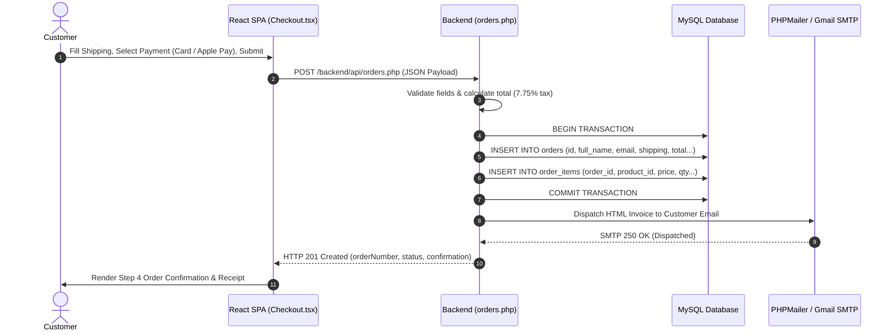
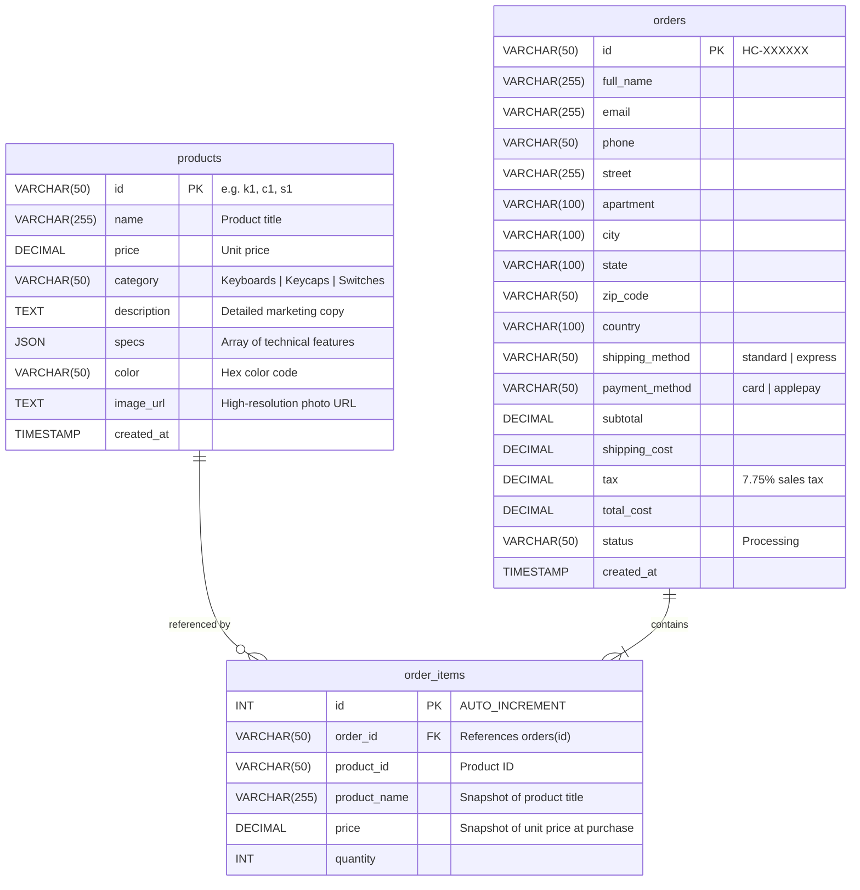

# ⌨️ Hypercaps — Artisan Mechanical Keyboards & Components

[](https://www.typescriptlang.org/)
[](https://reactjs.org/)
[](https://vitejs.dev/)
[](https://www.php.net/)
[](https://www.mysql.com/)
[](LICENSE)

**Hypercaps** is a modern, full-stack e-commerce web application designed specifically for mechanical keyboard enthusiasts. It offers an artisanal shopping experience for custom mechanical keyboards, doubleshot/PBT keycap sets, and premium lubricated switches.

Built with a high-performance **React 18 + TypeScript + Vite** Single Page Application (SPA) frontend and a lightweight **PHP 8 + MySQL** REST backend with automated **PHPMailer SMTP** order confirmation invoicing.

---

## 📑 Table of Contents

- [Key Features](#-key-features)
- [System Architecture](#-system-architecture)
- [Tech Stack](#-tech-stack)
- [Project Structure](#-project-structure)
- [Database Schema](#-database-schema)
- [Getting Started (Local Development)](#-getting-started-local-development)
- [Backend Configuration](#-backend-configuration)
- [API Reference](#-api-reference)
- [Deployment Guide (InfinityFree / Apache)](#-deployment-guide-infinityfree--apache)
- [Diagnostics & Utilities](#-diagnostics--utilities)
- [Important Hosting Notes](#-important-hosting-notes)

---

## ✨ Key Features

### 🛍️ Artisan Storefront
- **Dynamic Catalog Filtering**: Instant category switching across **Keyboards**, **Keycaps**, and **Switches** with deep-linking support (`/?category=Keyboards`).
- **Resilient Hybrid Visuals**: Displays high-resolution photography with smooth hover-zoom effects, paired with an automatic fallback to procedural CSS vector artwork if offline or on image load failure.
- **Product Details View**: Comprehensive component specifications, acoustic/chassis profiles, color palettes, and quantity selector.

### 🛒 Cart & State Management
- **Persistent Cart**: Global state powered by React Context (`CartContext`) backed by `localStorage` persistence.
- **Real-Time Financial Calculations**: Automatically calculates subtotal, 7.75% sales tax, and tiered shipping thresholds (Free shipping over \$150).

### 💳 Multi-Step Checkout Flow
- **Step 1 — Shipping & Contact**: Validated customer information, street address, postal code, and delivery speed selection (Standard vs. Express Priority).
- **Step 2 — Secure Payment**: Choice between **Credit Card** (with live card-spacing auto-formatting, MM/YY masking, and CVV validation) and **Apple Pay**.
- **Step 3 — Order Review**: Complete itemized summary and shipping/billing recap before final placement.
- **Step 4 — Order Confirmation**: Displays order reference ID (`HC-XXXXXX`), estimated delivery timeline, and records the purchase to the database while dispatching an HTML invoice.

### ✉️ Transactional Email Invoicing
- **PHPMailer SMTP Engine**: Sends styled, responsive HTML tax invoices directly to the customer's email address upon checkout.
- Bypasses shared hosting email restrictions (such as disabled PHP `mail()`) via secure TLS SMTP authentication.

### 🔄 Database Auto-Synchronizer & Diagnostics
- **One-Click Product Sync**: Script (`sync_products.php`) that ensures database tables exist and automatically seeds all 12 products with images, prices, specs, and descriptions.
- **Built-in Diagnostics**: Interactive health check (`test_db.php`) that validates MySQL connectivity, counts table records, and sends test emails via SMTP.

---

## 🏛️ System Architecture

```mermaid
flowchart TD
    subgraph Client["Client Tier (Browser / React SPA)"]
        UI["React 18 SPA (Vite + TypeScript)"]
        Router["React Router v6"]
        State["Cart Context (localStorage)"]
        Visual["ProductVisual (Photo + CSS Fallback)"]
    end

    subgraph WebServer["Web Server (Apache + mod_rewrite)"]
        HTAccess[".htaccess (SPA Routing & API Passthrough)"]
    end

    subgraph Backend["Backend Tier (PHP 8 REST API)"]
        API_Products["api/products.php (Catalog Feed)"]
        API_Orders["api/orders.php (Transaction Handler)"]
        Sync["sync_products.php (Database Seeder)"]
        Diag["test_db.php (Environment Health Check)"]
        DB_Conn["db.php (PDO Connection Pool)"]
        Mailer["PHPMailer (SMTP TLS 587)"]
    end

    subgraph DataTier["Data & External Services"]
        MySQL[("MySQL Database\n(products, orders, order_items)")]
        Gmail["Gmail SMTP Service\n(smtp.gmail.com:587)"]
    end

    UI --> Router
    Router --> State
    State --> Visual
    UI -->|HTTP / Fetch API| HTAccess

    HTAccess -->|/api/* or /backend/*| API_Products
    HTAccess -->|/api/* or /backend/*| API_Orders
    HTAccess -->|/* (SPA Navigation)| UI

    API_Products --> DB_Conn
    API_Orders --> DB_Conn
    API_Orders --> Mailer
    Sync --> DB_Conn
    Diag --> DB_Conn
    Diag --> Mailer

    DB_Conn --> MySQL
    Mailer -->|Authenticated TLS| Gmail
```

### Checkout Transaction Sequence



---

## 💻 Tech Stack

| Domain | Technology | Purpose |
|---|---|---|
| **Frontend Framework** | [React 18](https://react.dev/) | Component-based interactive user interface |
| **Language** | [TypeScript 5.5](https://www.typescriptlang.org/) | Type safety across cart, products, and checkout |
| **Build Tool** | [Vite 5.4](https://vitejs.dev/) | Lightning-fast HMR and optimized production bundling |
| **Routing** | [React Router 6](https://reactrouter.com/) | Client-side SPA navigation (`/`, `/product/:id`, `/cart`, `/checkout`) |
| **Styling** | Custom CSS3 + Variables | Clean typography, dark mode accents, responsive grid, animations |
| **Backend Engine** | [PHP 8.x](https://www.php.net/) | RESTful API endpoints, CORS handling, and transactions |
| **Database** | [MySQL 5.7 / 8.0](https://www.mysql.com/) | Relational storage for products, orders, and line items |
| **Database Driver** | PDO (PHP Data Objects) | Parameterized prepared statements preventing SQL injection |
| **Email Service** | [PHPMailer 6.x](https://github.com/PHPMailer/PHPMailer) | Authenticated SMTP transmission for transactional emails |
| **Web Server** | Apache (`.htaccess`) | SPA rewrite rules and PHP handler |

---

## 📁 Project Structure

```text
Hypercaps/
├── backend/                        # PHP Backend & Database Layer
│   ├── api/
│   │   ├── orders.php              # POST order checkout handler & invoice dispatch
│   │   └── products.php            # GET product catalog endpoint
│   ├── database/
│   │   └── schema.sql              # MySQL DDL table structures & initial seed data
│   ├── phpmailer/                  # Standalone bundled PHPMailer library
│   │   ├── Exception.php
│   │   ├── PHPMailer.php
│   │   └── SMTP.php
│   ├── db.php                      # PDO MySQL database connection & CORS configuration
│   ├── email_config.php            # SMTP server credentials (Gmail / custom SMTP)
│   ├── sync_products.php           # 1-Click web seeder for all 12 products into MySQL
│   └── test_db.php                 # Live diagnostic tool for database & email testing
├── public/
│   └── .htaccess                   # Apache URL rewrite rules for SPA client routing
├── src/                            # React TypeScript Frontend
│   ├── components/
│   │   ├── Footer.tsx              # Footer with category navigation & contact links
│   │   ├── Navbar.tsx              # Top navigation bar with live cart counter badge
│   │   ├── ProductCard.tsx         # Catalog product card with interactive add-to-cart
│   │   └── ProductVisual.tsx       # Hybrid component: Real image + CSS fallback
│   ├── context/
│   │   └── CartContext.tsx         # Global cart state provider with localStorage sync
│   ├── data/
│   │   └── products.ts             # Static product catalog definition & TypeScript types
│   ├── pages/
│   │   ├── Cart.tsx                # Shopping cart management & order summary
│   │   ├── Checkout.tsx            # Multi-step checkout (Address, Card/ApplePay, Review)
│   │   ├── Home.tsx                # Hero banner, category tabs, and product catalog
│   │   └── ProductDetail.tsx       # Single product detailed specifications view
│   ├── styles/
│   │   └── index.css               # Global stylesheets, responsive layouts, theme tokens
│   ├── App.tsx                     # Top-level router and application shell
│   └── main.tsx                    # React DOM entrypoint
├── dist/                           # Compiled production build output (Vite)
├── upload_to_htdocs.zip            # Pre-packaged, ready-to-deploy zip for web hosting
├── index.html                      # HTML5 root template
├── package.json                    # Node dependencies & npm scripts
├── tsconfig.json                   # TypeScript compiler configuration
└── vite.config.ts                  # Vite build tool configuration
```

---

## 🗄️ Database Schema

The database consists of three relational tables:



---

## 🚀 Getting Started (Local Development)

### Prerequisites
- **Node.js**: v18.0.0 or higher
- **npm**: v9.0.0 or higher
- **PHP**: v8.0+ *(Optional for local frontend development; required for backend)*
- **MySQL**: v5.7+ / v8.0+ *(Optional for local API testing)*

### Installation

1. **Clone the repository**:
   ```bash
   git clone https://github.com/your-username/hypercaps.git
   cd hypercaps
   ```

2. **Install Node dependencies**:
   ```bash
   npm install
   ```

3. **Start the local development server**:
   ```bash
   npm run dev
   ```
   Open your browser at `http://localhost:5173`.

4. **Build for production**:
   ```bash
   npm run build
   ```
   Generates optimized assets in the `dist/` directory.

5. **Lint the codebase**:
   ```bash
   npm run lint
   ```

---

## ⚙️ Backend Configuration

The backend files are located under `/backend/`.

### 1. Database Configuration (`backend/db.php`)
Set your MySQL credentials directly or via environment variables:

```php
$db_host = getenv('DB_HOST') ?: 'your-mysql-hostname';
$db_port = getenv('DB_PORT') ?: '3306';
$db_name = getenv('DB_NAME') ?: 'your-database-name';
$db_user = getenv('DB_USER') ?: 'your-database-username';
$db_pass = getenv('DB_PASS') ?: 'your-database-password';
```

### 2. Email SMTP Configuration (`backend/email_config.php`)
Configure your outgoing SMTP server for transactional order invoices:

```php
return [
    'enabled'    => true,
    'host'       => 'smtp.gmail.com',
    'port'       => 587,
    'encryption' => 'tls',
    'username'   => 'your_email@gmail.com',
    'password'   => 'your-app-password', // 16-character Google App Password
    'from_email' => 'your_email@gmail.com',
    'from_name'  => 'Hypercaps Keyboards',
];
```

> **Gmail Note**: You must generate an **App Password** from your Google Account settings (Security ➔ 2-Step Verification ➔ App passwords). Never use your primary Gmail login password.

---

## 📡 API Reference

### 1. Get Products
- **Endpoint**: `GET /backend/api/products.php`
- **Query Parameters**:
  - `category` *(optional)*: Filter by `Keyboards`, `Keycaps`, `Switches`, or `All`.
- **Response** (`200 OK`):
  ```json
  {
    "status": "success",
    "count": 12,
    "products": [
      {
        "id": "k1",
        "name": "Hyper-65 Graphite",
        "price": 189,
        "category": "Keyboards",
        "description": "A premium 65% mechanical keyboard...",
        "specs": ["65% Layout", "Gasket Mount", "Hot-swappable PCB", "RGB Backlit"],
        "color": "#2d2d2d",
        "imageUrl": "https://images.unsplash.com/..."
      }
    ]
  }
  ```

### 2. Submit Order
- **Endpoint**: `POST /backend/api/orders.php`
- **Headers**: `Content-Type: application/json`
- **Request Body**:
  ```json
  {
    "fullName": "Johan Liman",
    "email": "customer@example.com",
    "phone": "(555) 019-2834",
    "street": "100 Market St",
    "apartment": "Suite 400",
    "city": "San Francisco",
    "state": "CA",
    "zipCode": "94105",
    "country": "United States",
    "shippingMethod": "standard",
    "paymentMethod": "card",
    "subtotal": 189.00,
    "shippingCost": 0.00,
    "tax": 14.65,
    "totalCost": 203.65,
    "items": [
      {
        "id": "k1",
        "name": "Hyper-65 Graphite",
        "price": 189.00,
        "quantity": 1
      }
    ]
  }
  ```
- **Response** (`201 Created`):
  ```json
  {
    "status": "success",
    "orderNumber": "HC-839201",
    "message": "Order recorded successfully in MySQL database.",
    "subtotal": 189.00,
    "shippingCost": 0.00,
    "tax": 14.65,
    "totalCost": 203.65,
    "emailSent": true,
    "emailNotice": "Invoice successfully emailed via SMTP to customer@example.com.",
    "recipientEmail": "customer@example.com",
    "estimatedDays": "3 – 5 Business Days"
  }
  ```

---

## 🌐 Deployment Guide (InfinityFree / Apache)

The application is structured to be deployed directly onto standard Apache/PHP hosting (such as InfinityFree, cPanel, Namecheap, Hostinger, or VPS):

### Fast Deployment with `upload_to_htdocs.zip`

1. Run the build command locally:
   ```bash
   npm run build
   ```
2. The project contains a pre-packaged archive: **`upload_to_htdocs.zip`**.
3. Open your hosting **Control Panel** and launch the **Online File Manager**.
4. Navigate into your website's public web root: **`htdocs/`** (or `public_html/`).
5. Click **Upload Zip**, select `upload_to_htdocs.zip`, and choose **Upload & Unzip**.
6. The resulting web root structure will be:
   ```text
   htdocs/
   ├── .htaccess             <-- Handles React SPA routing & backend passthrough
   ├── index.html            <-- Vite React SPA entrypoint
   ├── assets/               <-- Compiled CSS and JavaScript chunks
   └── backend/              <-- PHP API scripts, DB config, and diagnostics
   ```
7. Visit your domain in the browser (e.g. `http://yourdomain.com`).

---

## 🛠️ Diagnostics & Utilities

Two dedicated web utilities are included in the backend:

### 1. Database Product Synchronizer (`backend/sync_products.php`)
- **URL**: `http://yourdomain.com/backend/sync_products.php`
- **Function**: Automatically updates your MySQL schema (adding `image_url` if needed) and inserts/updates all **12 products** with their official prices, descriptions, specs, and images.

### 2. Environment Diagnostics (`backend/test_db.php`)
- **URL**: `http://yourdomain.com/backend/test_db.php`
- **Function**:
  - Tests live PDO connection to MySQL.
  - Verifies presence and row counts for `products`, `orders`, and `order_items` tables.
  - Provides a one-click button to trigger product synchronization.
  - Displays SMTP configuration status and lets you send a live test email to verify credentials.

---

## ⚠️ Important Hosting Notes

1. **SPA Routing via `.htaccess`**:  
   Because React Router uses HTML5 history API paths (such as `/checkout` and `/product/k1`), the included `public/.htaccess` routes all non-file browser requests to `index.html`, while allowing `/backend/` and `/api/` calls to execute directly as PHP scripts.

2. **InfinityFree Free Tier Email Policy**:  
   Free hosting providers disable PHP's native `mail()` function to prevent spam. All emails in Hypercaps use **PHPMailer with authenticated SMTP on port 587 (STARTTLS)**, which works reliably across any free or shared host.

3. **InfinityFree MySQL Host**:  
   Free hosting MySQL servers are not accessible on `localhost`. Always check your hosting control panel for your assigned MySQL host (e.g., `sql207.infinityfree.com`).

---

## 📄 License

This project is licensed under the [MIT License](LICENSE).
