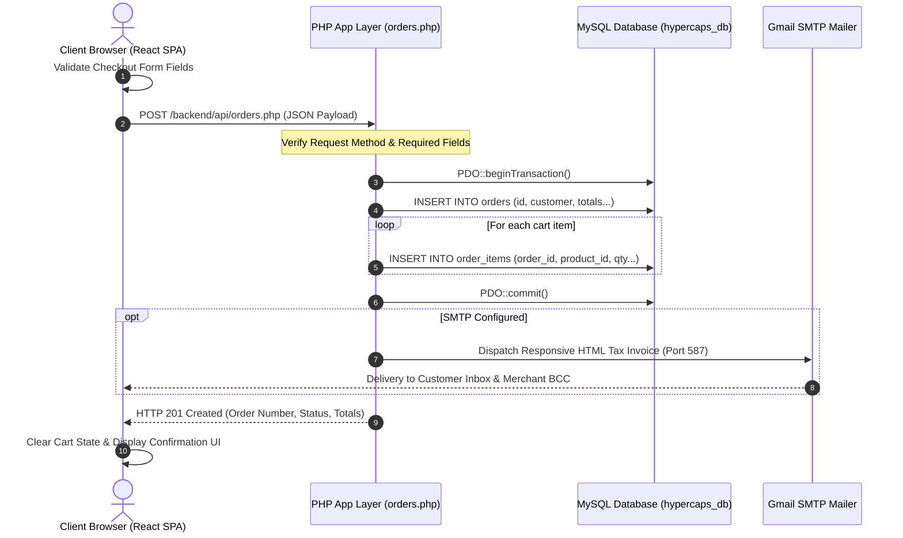

# 🏛️ System Architecture (Deployment View)

**Project**: Hypercaps — Artisan Mechanical Keyboards & Components  
**Architecture Pattern**: Decoupled Client-Server Tier with RESTful API  
**Deployment Model**: Single Host / Hybrid Static SPA & PHP Web Service  

---

## 1. System Architecture Diagram

---

## 2. Architectural Layers & Component Specifications

### 🌐 1. Client Tier (`Client browser`)
- **Technology**: React 18.3, TypeScript 5.5, Vite 5.4, Modern CSS3
- **Responsibilities**:
  - High-performance Single Page Application (SPA) delivery.
  - Interactive artisan catalog browsing, product filtering by category (Keyboards, Keycaps, Switches), and real-time search.
  - Interactive 3D CSS Keycap Visualizer (`ProductVisual.tsx`).
  - Client-side shopping cart persistence via `localStorage` and React Context API (`CartContext.tsx`).
  - Comprehensive client-side form validation before submitting order payloads (`Checkout.tsx`).

### ⚙️ 2. Application & API Tier (`PHP App Layer`)
- **Runtime**: Apache 2.4 HTTP Server, PHP 8.2 with PDO Extension
- **Sub-components**:
  - **Diagnostics (`test_db.php`)**: Validates MySQL table structure, record integrity, and triggers live Gmail SMTP connection health checks.
  - **Catalog API (`products.php`)**: Serves catalog JSON responses with sanitized category query parameters and decodes structured JSON specifications.
  - **Catalog Sync (`sync_products.php`)**: Automated schema synchronizer ensuring all 18 artisan keyboard components and Unsplash CDN image URLs are populated via `ON DUPLICATE KEY UPDATE`.
  - **Checkout API Engine (`orders.php`)**: 
    - Enforces input validation (strict JSON parsing, mandatory customer contact fields, non-empty items array).
    - Computes financial totals (subtotal, shipping tier, 7.75% California sales tax).
    - Dispatches branded HTML tax invoices via PHPMailer SMTP (Port 587 TLS / 465 SSL) with native `mail()` fallback.
  - **Data Access Layer (`db.php`)**: Centralized PDO connector using environment variable hierarchy, persistent utf8mb4 encoding, and strict SQL exception handling.

### 🗄️ 3. Persistence Tier (`MySQL schema`)
- **Database Engine**: MySQL 5.7 / MariaDB (InnoDB, `utf8mb4_unicode_ci`)
- **Schema Name**: `if0_42966179_hypercaps_db`
- **Core Entities**:
  - **`orders`**: Stores master order transactions, generated order IDs (`HC-XXXXXX`), customer contact & shipping details, financial calculations, and fulfillment status (`Processing`).
  - **`order_items`**: Child table maintaining relational one-to-many associations for purchased products, quantities, and historical unit prices.
  - **`products`**: Master product catalog including SKU IDs, pricing, category taxonomy, markdown descriptions, JSON specifications, and high-res image URLs.
  - **`details` (`schema.sql`)**: Structural integrity DDL defining foreign key constraints, primary keys, and index optimizations.

### 📊 4. Monitoring, Logging & Profiling Integrations
- **Monitoring (PHPMailer / SMTP)**: Live transmission verification with debug capture on Port 587/465, sending automated order confirmations to customers and merchant BCC notifications.
- **CSV Logs (`email_error.log`)**: Persistent append-only diagnostic log capturing runtime SMTP failure details and system errors.
- **Matplotlib Charts**: Python profiling suite generating workload benchmarks, memory distribution charts, and Core Web Vitals performance timelines (`docs/performance/`).

### 🚀 5. Deployment Topology
- **Production Server**: Apache 2.4 virtual host running PHP 8.2 FastCGI with MySQL PDO drivers.
- **Client Delivery**: Vite-optimized production build (pre-bundled ESModules, chunking, and minified CSS assets).
- **Communication Protocol**: HTTPS REST API with CORS headers configured in `db.php` for seamless cross-origin communication between the client SPA and backend endpoints.

---

## 3. Mermaid Sequence Diagram: Order Placement Flow

---

## 4. System Component & Dataflow Walkthrough

• **User Browser**  
o This is where the customer journey begins. The user interacts with Hypercaps through their browser (Chrome, Safari, Edge), exploring artisan keyboard builds, sending requests to the application, and viewing dynamic, client-rendered views in return.

• **Frontend**  
o Powered by React 18, TypeScript, and Vite, the frontend manages what the user sees and interacts with. It renders the responsive UI and 3D visualizers, handles cart state via `localStorage`, performs client-side form validation, and dispatches structured JSON payloads to the server via asynchronous API requests.

• **Server**  
o The server is the application’s core processing engine. Built with PHP 8.2 on Apache, it enforces CORS security headers, executes business logic—including shipping tier evaluations, 7.75% sales tax computations, and atomic PDO transactions—and coordinates with PHPMailer over SMTP to dispatch official HTML tax invoices.

• **MySQL Database**  
o The relational database (`hypercaps_db`) preserves all critical records. Using the InnoDB engine, it processes parameterized SQL queries to store and retrieve artisan keyboard specifications (`products`), customer checkout orders (`orders`), and relational purchased quantities (`order_items`).

• **Forward Request Path**  
o This traces the user’s action as it flows through the architecture: beginning with customer actions in the browser, passing through client-side validation in the React frontend, transmitting via HTTPS POST to the PHP backend API, and concluding with transactional commits in the MySQL database.

• **Return Response Path**  
o Once the transaction is finalized, the response travels back up the chain—from MySQL commit confirmation to the PHP server (which generates the order ID and triggers the SMTP invoice), returning an HTTP 201 JSON payload to the frontend, where the user instantly sees their completed order confirmation and cleared cart.

• **Logs and Metrics**  
o A supporting diagnostic tier that quietly monitors system stability, query execution, and email delivery. It utilizes connection diagnostic utilities (`test_db.php`), error trace files (`email_error.log`), and Matplotlib benchmarking charts to verify platform health without interrupting user transactions.

