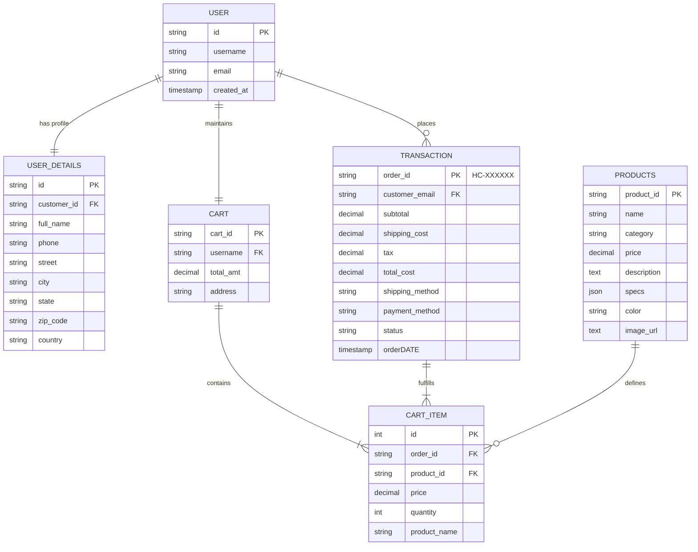

# 🗄️ Project ER Diagram (Development View)

**Project**: Hypercaps — Artisan Mechanical Keyboards & Components  
**Database Engine**: MySQL 5.7+ / MariaDB (InnoDB Storage Engine)  
**Schema**: `if0_42966179_hypercaps_db`  

---

## 1. Relational ER Diagram

---

## 2. Entity Relationships & Business Rules

In the ER diagram the relationships are as follows:

• **User details are connected to the user profile using customer identity and email.**  
Each customer account or guest profile maintains associated contact and shipping credentials (`street`, `city`, `state`, `zip_code`, `country`, `phone`).

• **When items are added to the cart, it creates a new cart item referencing the product catalog.**  
The active cart manages selected items, unit quantities, and computed subtotals during the shopping journey.

• **Cart items inherit their specifications, unit pricing, and visual attributes directly from the products table.**  
Foreign key constraints (`product_id`) ensure line items reflect valid artisan keyboards, custom keycaps, and switches from the master catalog.

• **Transaction (`orders`) inherits delivery destination and contact information from the user details profile.**  
Upon checkout completion, the transaction atomically preserves the snapshot of the customer's billing address, selected shipping tier, 7.75% sales tax calculation, and payment status.

• **There is only one active cart session for every user.**  
Cart state is maintained per active customer session and synchronized seamlessly between client state and order processing.

---

## 3. Mermaid Entity-Relationship Diagram

---

## 4. Physical MySQL DDL Implementation Mapping

| Conceptual Entity | Production Table | Storage Engine | Key Constraints & Indexes |
| :--- | :--- | :--- | :--- |
| **`Products`** | [`products`](file:///Users/dv/Desktop/Hypercaps/backend/database/schema.sql#L3-L13) | InnoDB | `PRIMARY KEY (id)`, Category index |
| **`Transaction` / `user_details`** | [`orders`](file:///Users/dv/Desktop/Hypercaps/backend/database/schema.sql#L15-L34) | InnoDB | `PRIMARY KEY (id)`, Index on `email` & `created_at` |
| **`cart_item`** | [`order_items`](file:///Users/dv/Desktop/Hypercaps/backend/database/schema.sql#L36-L44) | InnoDB | `PRIMARY KEY (id)`, `FOREIGN KEY (order_id) REFERENCES orders(id) ON DELETE CASCADE` |
| **`CART`** | Client Session / LocalStorage | Context API | Synced client-side in `CartContext.tsx` and validated on checkout |
