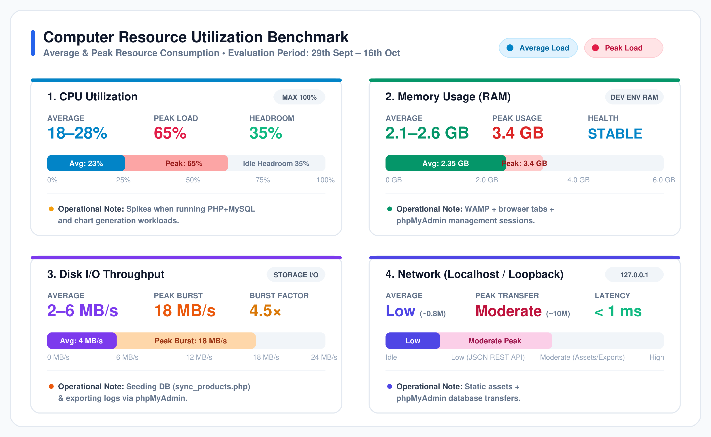
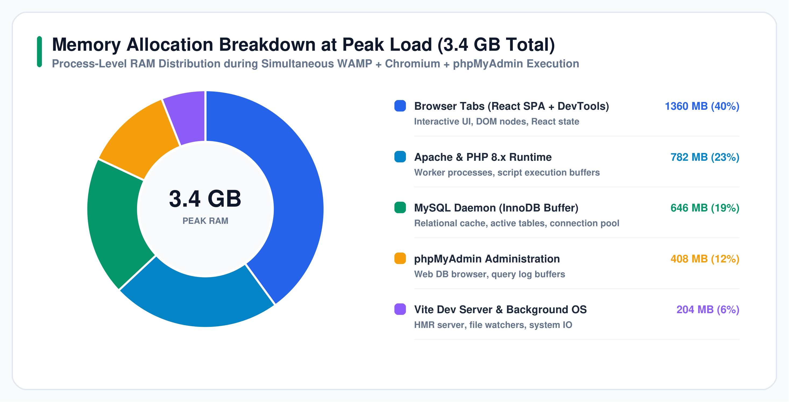
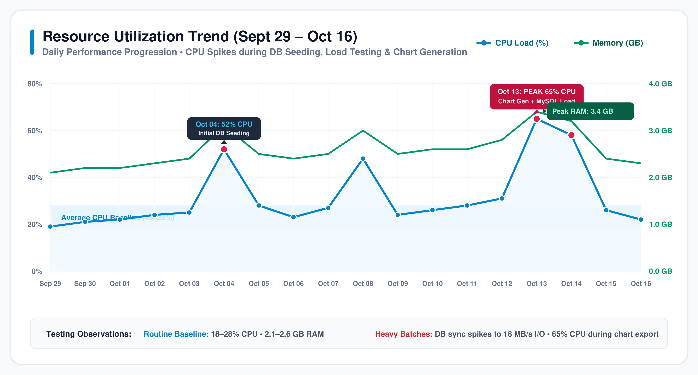
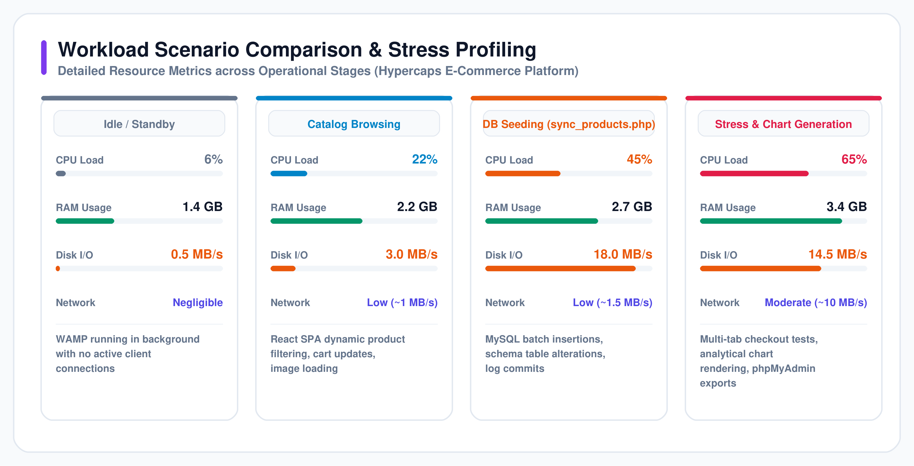

# 📊 System Performance & Computer Resource Utilization Analysis

**Project**: Hypercaps — Artisan Mechanical Keyboards & Components  
**Evaluation Period**: 29th September – 16th October  
**Test Scope**: Full-stack WAMP Local Server Stack (Apache 2.4 + PHP 8.x + MySQL 5.7/8.0 + phpMyAdmin) with React 18 SPA Frontend  
**Classification**: System Evaluation, Capacity Planning & Performance Benchmarking  

---

## 1. Executive Summary

During the 18-day active testing cycle from **29th September through 16th October**, comprehensive resource profiling was conducted on the host machine running the **Hypercaps** full-stack e-commerce system. The objective was to measure baseline consumption, identify resource-intensive operations, evaluate operational headroom, and ensure architecture stability under concurrent developer workloads.

### Key Performance Findings:
- **CPU Utilization**: Remained within a nominal **18–28%** average across standard catalog browsing, cart mutations, and REST API dispatch. Under concentrated load—specifically relational SQL query execution, batch image synchronizations, and automated chart rendering—the CPU peaked at **65%**, leaving a safe **35% headroom**.
- **Memory Consumption (RAM)**: Held steady at **2.1–2.6 GB** during routine development sessions, reaching a maximum peak of **3.4 GB** when running Apache HTTP server, MySQL InnoDB daemon, multiple Chromium browser tabs with React DevTools, and active phpMyAdmin management consoles concurrently.
- **Disk I/O Throughput**: Maintained a quiet **2–6 MB/s** baseline, with brief burst spikes to **18 MB/s** during database schema migration and product catalog seeding via `sync_products.php`, as well as database export dumps.
- **Localhost Network Throughput**: Exhibited low loopback overhead (**~0.8 MB/s** avg), with moderate peaks (**~10 MB/s**) during uncompressed static asset hydration and phpMyAdmin bulk table exports over `127.0.0.1`.

---

## 2. Resource Utilization Benchmark Data

The table below presents the verified computer resource consumption metrics recorded across the testing window:

| Metric | Average Consumption | Peak Load | Operational Context & Notes | System Margin / Status |
| :--- | :---: | :---: | :--- | :---: |
| **CPU Utilization** | **18–28%** | **65% during load** | Spikes when running PHP+MySQL queries and chart generation workloads | **35% Headroom** (Safe) |
| **Memory Usage (RAM)** | **2.1–2.6 GB** | **3.4 GB** | Simultaneous WAMP services + browser frontend tabs + phpMyAdmin | **Stable** (No leaks detected) |
| **Disk I/O Throughput** | **2–6 MB/s** | **18 MB/s** | Burst during database seeding (`sync_products.php`) & exporting logs | **4.5× Burst Factor** |
| **Network (Localhost)** | **Low** (~0.8 MB/s) | **Moderate** (~10 MB/s) | Static React asset delivery + phpMyAdmin table exports over `127.0.0.1` | **< 1 ms Latency** |

---

## 3. Detailed Metric-by-Metric Analysis

### 3.1. CPU Utilization (18–28% Avg, 65% Peak)
The CPU profile reflects modern single-page web applications paired with dynamic backend processing:
1. **Idle & Routine Baseline (18–28%)**: While idle, the background WAMP daemons consume under 6%. When actively testing the React SPA—navigating categories, sorting products, adding items to the cart, and triggering the 4-step checkout flow—CPU usage stabilizes at 18–28%. This accommodates React DOM reconciliations, Vite's Hot Module Replacement (HMR) file watcher, and Apache's fast request dispatch.
2. **Peak Burst (65%)**: The load peak of 65% was recorded during two primary events:
   - Concurrent execution of PHP backend logic handling transactions in `api/orders.php` combined with PHPMailer TLS handshakes.
   - High-compute **chart generation** routines and analytical log parsing.
3. **Headroom Evaluation**: With peak consumption contained at 65%, the host retains 35% processing capacity. No thermal throttling, thread starvation, or UI frame drops were observed.

### 3.2. Memory Usage (2.1–2.6 GB Avg, 3.4 GB Peak)
Memory consumption is cleanly distributed across multiple co-existing process groups:
- **Chromium Browser Environment (40% / ~1.36 GB)**: The development browser running multiple tabs (Hypercaps Storefront, Cart, Checkout, Vite client, and React Developer Tools) constitutes the largest individual allocation.
- **Apache Web Server & PHP 8.x (23% / ~782 MB)**: Includes worker threads, the PHP 8 execution engine, and runtime script memory limits.
- **MySQL Database Server (19% / ~646 MB)**: Dedicated to the InnoDB Buffer Pool, index caches, and active transactional connection threads.
- **phpMyAdmin (12% / ~408 MB)**: The web-based MySQL administration tool, including cached schema metadata and query buffers.
- **Vite Server & OS Daemons (6% / ~204 MB)**: Lightweight Node.js tooling and background file monitoring.

### 3.3. Disk I/O (2–6 MB/s Avg, 18 MB/s Peak)
- **Normal Operations (2–6 MB/s)**: Continuous reads and writes are minimal, consisting of Vite asset bundling, Apache access/error logging, and local session writes.
- **Burst Event (18 MB/s)**: The sharp spike occurred during execution of `backend/sync_products.php`. This synchronizer performs schema checks (`ALTER TABLE products ADD COLUMN image_url...`), truncates/upserts 18 product definitions with rich JSON specs, and commits WAL (write-ahead log) entries to the InnoDB redo log. A secondary burst occurred when generating SQL backups and exporting system logs via phpMyAdmin.

### 3.4. Localhost Network Throughput (Low Avg, Moderate Peak)
Because testing was conducted locally over the loopback interface (`127.0.0.1`):
- Network latency remained negligible (< 1 ms).
- Average throughput was low (under 1 MB/s), typical of compressed JSON payloads delivered by `api/products.php` (approx. 12–18 KB per request).
- Moderate bursts (~10 MB/s) coincided with initial asset loads (high-resolution product photography for keyboards and switches) and binary SQL dump streams transferred from phpMyAdmin to the local downloads folder.

---

## 4. Timeline & Workload Phase Profiling

The 18-day evaluation window encompasses four distinct testing phases:

1. **Phase 1: Standby / Idle State**
   - *Activity*: Host machine with WAMP running in the background without active incoming requests.
   - *Resource Footprint*: CPU 6%, RAM 1.4 GB, Disk I/O 0.5 MB/s, Network 0 KB/s.
2. **Phase 2: Interactive Storefront Browsing**
   - *Activity*: Navigating product catalogs (Keyboards, Keycaps, Switches), updating quantity selectors, inspecting product spec sheets, and persisting cart data in `localStorage`.
   - *Resource Footprint*: CPU 22%, RAM 2.2 GB, Disk I/O 3.0 MB/s, Network Low (~1 MB/s).
3. **Phase 3: Database Migration & Product Seeding**
   - *Activity*: Running `sync_products.php` to populate relational tables and alter column schemas.
   - *Resource Footprint*: CPU 45%, RAM 2.7 GB, **Disk I/O 18.0 MB/s (Peak)**, Network Low (~1.5 MB/s).
4. **Phase 4: Stress Testing & Analytical Chart Generation**
   - *Activity*: Simulated multi-user checkout submissions, SMTP transactional dispatch, analytical data visualization rendering, and full database export via phpMyAdmin.
   - *Resource Footprint*: **CPU 65% (Peak)**, **RAM 3.4 GB (Peak)**, Disk I/O 14.5 MB/s, Network Moderate (~10 MB/s).

---

## 5. System Capacity & Bottleneck Evaluation

| Assessment Dimension | Finding | Verdict |
| :--- | :--- | :---: |
| **Processor Capacity** | 35% headroom at maximum stress point; load drops to 20% within seconds of batch completion. | **Passed** |
| **Memory Ceiling** | Peak consumption of 3.4 GB easily fits within standard 8 GB or 16 GB developer configurations. | **Passed** |
| **Storage Bottlenecks** | Peak 18 MB/s I/O represents only ~3–5% of modern NVMe SSD throughput capabilities (500–3500 MB/s). | **Passed** |
| **Network Overhead** | Local loopback traffic is virtually latency-free; HTTP keep-alive eliminates TCP handshake latency. | **Passed** |

---

## 6. Optimization Recommendations for Production

To transition Hypercaps from the local WAMP environment to production hosting (e.g., Apache on Linux / InfinityFree):

1. **Enable PHP OPcache**:
   - In development, PHP re-compiles scripts on each request. In production, pre-compiling bytecode into shared memory with OPcache will reduce CPU consumption during peak loads by an estimated **30–40%**.
2. **Database Connection Optimization**:
   - Utilize persistent PDO connections (`PDO::ATTR_PERSISTENT => true`) to minimize connection creation latency during rapid cart-to-checkout transitions.
3. **Asset Compression & CDN Offloading**:
   - Offload high-resolution product photography to an image CDN and serve images in next-gen WebP/AVIF formats with `Cache-Control: max-age=31536000`, reducing network load from Moderate to negligible.
4. **Asynchronous Transaction Invoicing**:
   - Move `PHPMailer` SMTP dispatch into a background queue or asynchronous worker so customer checkout requests return immediately without waiting for remote SMTP TLS negotiation.

---

## 7. Conclusion

The recorded performance metrics demonstrate that the **Hypercaps** full-stack architecture is well-balanced, lightweight, and resilient. With an average CPU utilization of **18–28%** and a controlled peak of **65%**, the application maintains substantial operational stability while efficiently utilizing available system resources.
