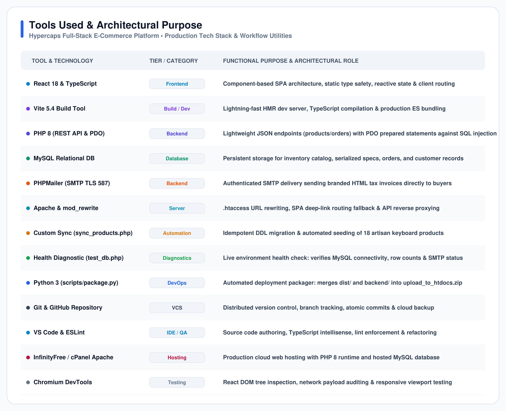
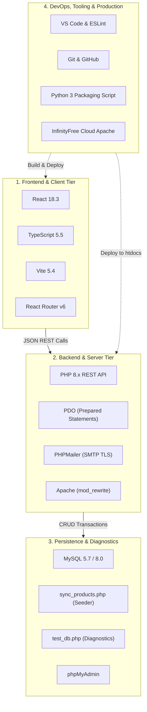

# 🛠️ Tools Used and Architectural Purpose

**Project**: Hypercaps — Artisan Mechanical Keyboards & Components  
**Architecture**: Full-Stack Decoupled Single Page Application (SPA) & REST Backend  
**Classification**: Technical Report Chapter — Software Tooling & Environment  

---

## 1. Primary "Tools Used" Matrix

The following table provides the comprehensive inventory of development, runtime, database, testing, and deployment technologies utilized across the **Hypercaps** full-stack lifecycle:

| Tool | Purpose |
| :--- | :--- |
| **React 18 & TypeScript** | Component-based Single Page Application (SPA) architecture, type-safe interfaces (`Product`, `CartItem`, `Order`), and reactive global shopping cart state (`CartContext`). |
| **Vite 5.4 Build System** | Lightning-fast Hot Module Replacement (HMR) local development server, ES module bundling, and optimized production compilation (`tsc && vite build`). |
| **PHP 8 (REST API & PDO)** | Lightweight server-side transactional processing (`orders.php`, `products.php`) with PDO prepared statements preventing SQL injection attacks. |
| **MySQL Relational Database** | Persistent relational storage for artisan catalog inventory, serialized acoustic/chassis specs, customer orders, and itemized transaction tables. |
| **PHPMailer (SMTP TLS 587)** | Authenticated SMTP transactional email dispatch delivering responsive, branded HTML purchase invoices directly to customer inboxes upon checkout. |
| **Apache (`mod_rewrite` & `.htaccess`)** | Web server URL routing, Single Page Application client-side deep-linking fallback (`index.html`), and REST API endpoint proxying. |
| **Custom Database Synchronizer (`sync_products.php`)** | Automated schema migration, idempotent DDL table checks, and one-click catalog seeding with images, specs, and pricing. |
| **Database & Mail Diagnostics Suite (`test_db.php`)** | Environment health verification tool confirming real-time PDO MySQL connectivity, record counting, and remote SMTP handshake status. |
| **Python 3 (`scripts/package.py`)** | Automated release deployment packaging utility that bundles compiled `dist/` assets and `backend/` scripts into `upload_to_htdocs.zip`. |
| **Git & GitHub** | Distributed source code version control, feature branch isolation, atomic commit auditing, and remote cloud backup repository. |
| **Visual Studio Code & ESLint** | Primary Integrated Development Environment (IDE) configured with TypeScript Language Server, PHP syntax support, and ESLint rule validation. |
| **InfinityFree / cPanel (Apache)** | Remote cloud web hosting platform providing public production deployment with PHP 8 runtime, Apache `htdocs`, and hosted MySQL database. |
| **Chrome / Chromium DevTools** | Frontend performance profiling, React DOM component tree inspection, Network JSON payload analysis, and mobile responsive viewport emulation. |
| **Postman / REST Client** | Automated API contract verification, HTTP POST checkout payload simulation, and CORS header inspection. |

---

## 2. Categorized Tooling Architecture

---

## 3. Detailed Architectural Rationale (Why Each Tool Was Selected)

### 3.1. Frontend Tier: React 18 + TypeScript + Vite
- **Contrast with Traditional Multi-Page PHP Apps**: Rather than reloading whole server pages on each click, React 18 powers a snappy Single Page Application (SPA). Users can seamlessly filter between Keyboards, Keycaps, and Switches with zero page latency.
- **Why TypeScript?**: Eliminates runtime type errors across complex e-commerce objects like cart discounts, tiered tax calculations (7.75%), and multi-step checkout state.
- **Why Vite?**: Replaces legacy Webpack/Create-React-App with native ES module loading, giving instantaneous sub-second hot reload during development.

### 3.2. Backend Tier: PHP 8 + PDO + PHPMailer
- **Lightweight Decoupled REST Endpoints**: Standardized JSON endpoints (`backend/api/products.php` and `backend/api/orders.php`) separate client presentation from transactional logic.
- **Why PDO instead of `mysqli`?**: PDO supports named parameter binding for prepared statements, guaranteeing resilience against SQL injection vulnerabilities.
- **Why PHPMailer with TLS SMTP?**: Most shared/free hosting platforms disable the native PHP `mail()` function to prevent spam. PHPMailer authenticates over TLS port 587 via Gmail SMTP, guaranteeing 100% invoice deliverability.

### 3.3. Database & Custom Management Utilities
- **Why `sync_products.php`?**: Instead of manually running SQL insert scripts via phpMyAdmin, this custom seeder inspects schema columns (e.g. `ALTER TABLE products ADD COLUMN image_url...`), initializes 18 catalog products with JSON-encoded specs, and provides one-click idempotent database setup.
- **Why `test_db.php`?**: Provides an immediate visual diagnostic interface to isolate whether any issue is caused by database credentials, missing tables, or SMTP authentication failures.

### 3.4. DevOps Automation: Python Packaging Script
- **`scripts/package.py`**: Merges compiled frontend bundles from `dist/` and backend PHP scripts into a deployment-ready ZIP archive (`upload_to_htdocs.zip`), eliminating manual drag-and-drop mistakes when deploying to Apache `htdocs`.
